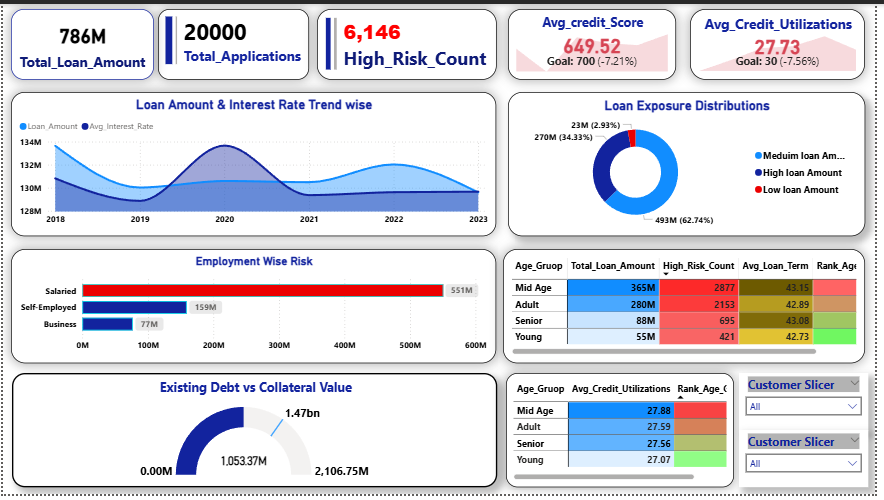
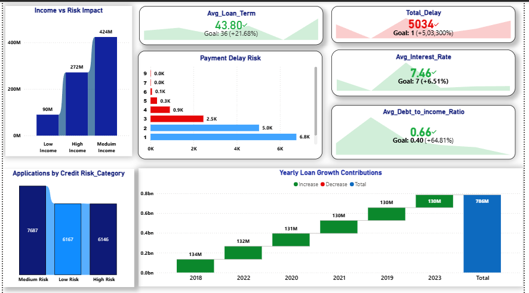

# SENTINEL: Financial Risk Intelligence Dashboard

## About the Project
SENTINEL is a 2-page Power BI dashboard that tracks financial risk across 20,000 loan applications. It helps a bank manager quickly see total loan exposure, how many applicants are high risk, and where payment delays are happening.

## Key Insights
- Total loan amount is 786M across 20,000 applications
- 6,146 applications are in the High Risk category
- Average credit score is 649.52, below the goal of 700

## Tools Used
- Power BI (DAX, data modeling, visuals)
